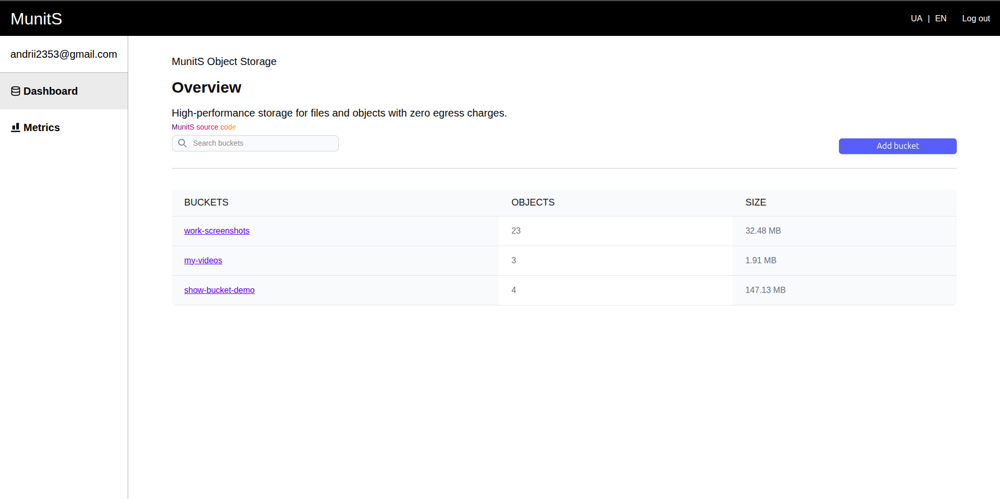
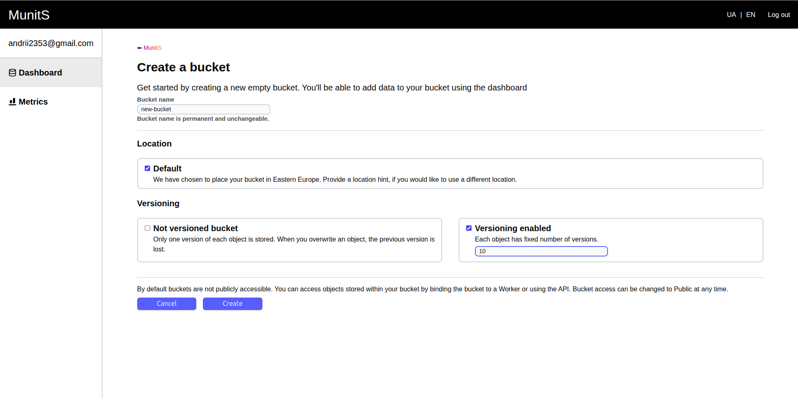
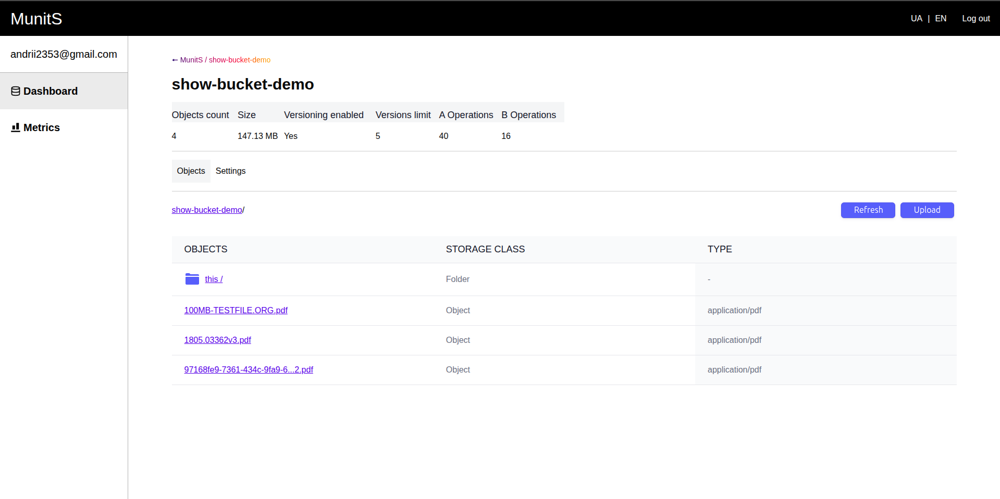
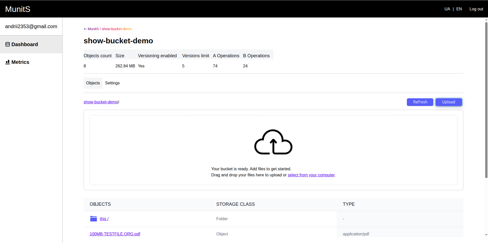
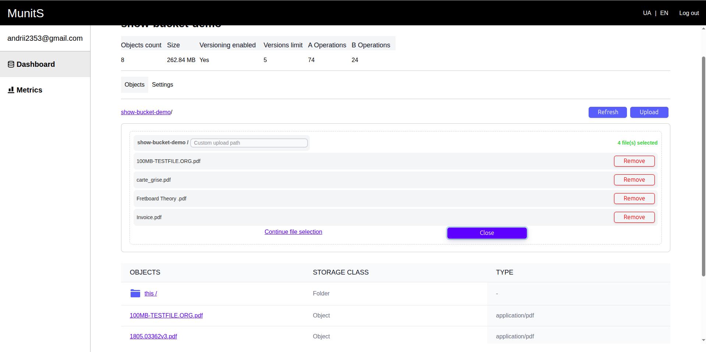
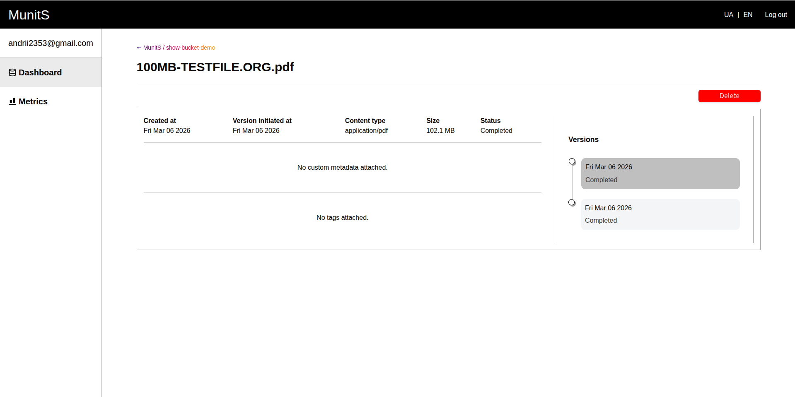

The system consists of **two parts** and **three components**:

1. **MunitS Hub**
   - [**MunitS Hub Client**](https://github.com/AndriiS1/munits-hub-client) – a frontend interface to showcase the storage capabilities.
   - [**MunitS Hub Backend**](https://github.com/AndriiS1/munits-hub) – a backend layer between the client and the object storage, providing authentication and management functionality.
2. [**MunitS**](https://github.com/AndriiS1/munits) – an **integrable object storage solution** that can be connected to other systems.

# MunitS Hub Client

MunitS Hub Client is the official web front-end for the [MunitS Object Storage](https://github.com/AndriiS1/MunitS) system. It provides a modern, user-friendly interface for managing buckets, objects, and user settings. Built with React, TypeScript, and Vite, this client offers a responsive and efficient user experience for interacting with your storage.

## Demo


_1. Buckets overview._


_2. Create bucket overview._


_3. Bucket overview._


_4. Upload form overview._


_5. Upload overview._


_6. Object overview._


_7. Metrics overview._

## Getting Started

Follow these instructions to get a copy of the project up and running on your local machine for development and testing purposes.

### Prerequisites

- Node.js (v18 or newer)
- npm or an equivalent package manager

### Running the Application

1. **Clone the repository:**

```sh
git clone https://github.com/AndriiS1/munits-hub-client.git
```

2. **Navigate to the project directory:**

```sh
cd munits-hub-client
```

3. **Install the dependencies:**

```sh
npm install
```

4. **Configure Environment Variables:** Create a `.env` file in the root of the project and add the URL for your MunitS Hub backend server.

```
VITE_MUNITS_HUB_SERVER_URL=http://localhost:5000/api
```

1. **Run the application:**

```sh
npm run dev
```

The application will be available at `http://localhost:3000`.

## Available Scripts

In the project directory, you can run the following scripts:

- `npm run dev`: Starts the development server with Hot Module Replacement (HMR).
- `npm run build`: Compiles TypeScript and bundles the application for production.
- `npm run lint`: Lints the codebase using ESLint to identify and fix code quality issues.
- `npm run preview`: Serves the production build locally to preview the final app.

## Project Structure

The project follows a component-based architecture to promote modularity and reusability. Key directories include:

```
src/
├── Assets/              # SVG icons
├── Components/          # Reusable React components (e.g., Button, Input, UploadArea)
├── Localization/        # Language files for internationalization
├── Pages/               # Top-level page components for different routes
├── Services/            # API interaction services (auth, buckets, objects)
├── Utils/               # Utility functions (e.g., file size formatting)
├── components/ui/       # shadcn/ui components
├── lib/                 # Core utility files
├── main.tsx             # Main application entry point
└── routes.tsx           # Application routing configuration
```

# Don't forget to check

- [MunitS](https://github.com/AndriiS1/munits)
- [MunitS Hub Backend](https://github.com/AndriiS1/munits-hub)
